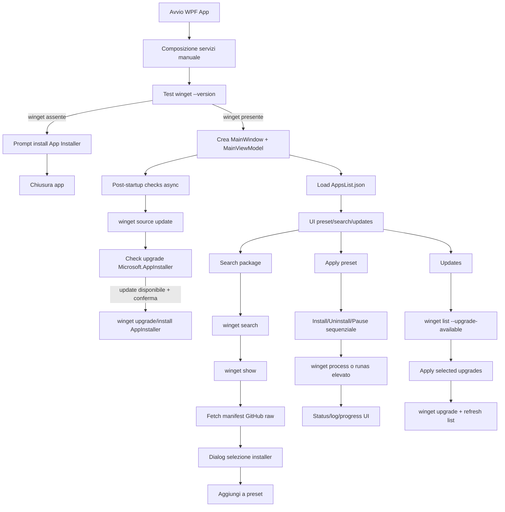
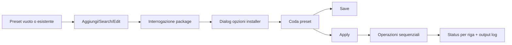
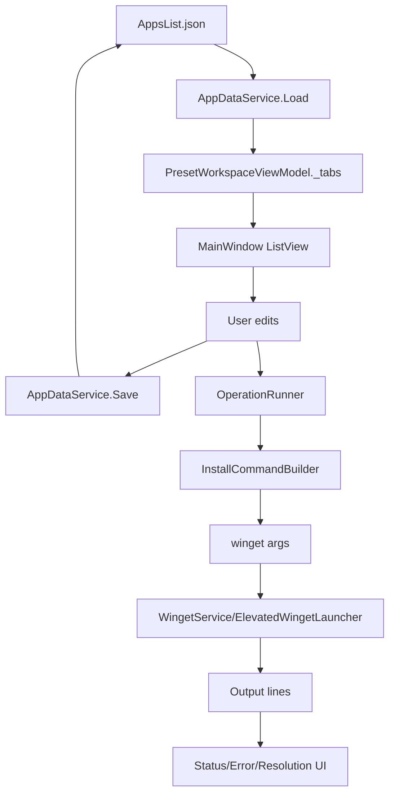
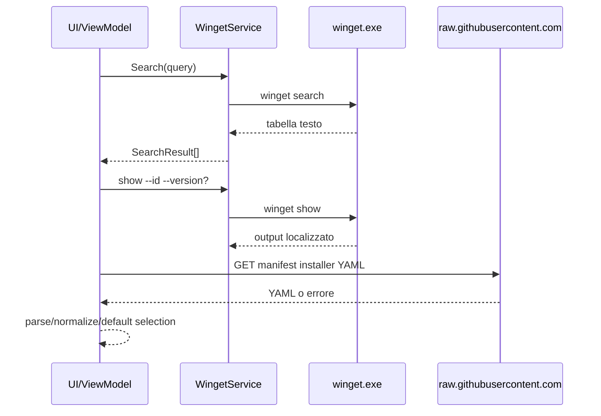

# APP_FLOW - OnlyWinget

## Schema generale

OnlyWinget e' una app desktop WPF Windows che orchestri preset locali e operazioni `winget`.
Non esistono backend, API server, database o autenticazione applicativa. La persistenza e' JSON locale in `%LOCALAPPDATA%\OnlyWinget\AppsList.json`; i log operativi winget finiscono in `%LOCALAPPDATA%\OnlyWinget\runtime`.

## Flusso step-by-step

1. `App.OnStartup` crea direttamente `AppPreferencesService`, `LocalizationService`, `WingetService`, `InstallCommandBuilder`, `WingetPackageInterrogationService`, `DialogService`, `AppEntryService`, `TabService`, `OperationRunner` e `AppStartupCoordinator`.
2. `MainViewModel` calcola subito `IsWingetAvailable` con `winget --version`.
3. Se winget manca, `AppStartupCoordinator.CanContinueStartup` propone il link Microsoft Store App Installer e poi chiude l'app.
4. Se winget esiste, viene mostrata `MainWindow`; `MainViewModel.Initialize` carica preset, registra OS/elevazione e mostra la UI.
5. In background parte `RunPostStartupChecksAsync`: aggiorna sorgenti winget, controlla update di `Microsoft.AppInstaller`, opzionalmente aggiorna winget.
6. La UI principale alterna tre stati: preset workspace, search workspace, updates workspace.

## Flusso utente principale

- Aggiunta manuale: prompt nome, prompt id, prompt source, poi interrogazione.
- Search: `winget search --query`, selezione uno o piu' risultati, interrogazione per ogni package.
- Edit: reinterroga package esistente e riapplica selezioni valide.
- Apply: copia snapshot delle righe abilitate e processa install/uninstall/pause una alla volta.

## Flusso dati

Persistenza:
- formato corrente: root JSON con tabs e apps.
- formato legacy non supportato: se il file non inizia con `{`, viene trattato come invalid data.
- import/export preset: file `.onlywinget.json` con preset singolo.
- salvataggio atomico: scrittura `.tmp`, `File.Replace` se il file esiste, cleanup del tmp.

## Flusso integrazioni esterne

Dipendenze reali:
- `winget.exe` e sorgenti winget.
- Microsoft Store/App Installer per aggiornamento winget.
- GitHub raw `microsoft/winget-pkgs` per manifest installer.
- WiX 3.14 bundled per packaging.

## Flusso errori/fallback

- `DispatcherUnhandledException`: mostra `Exception.Message` o `InnerException.Message`, marca handled e chiude app.
- Comandi UI asincroni: `ExecuteSafelyAsync` cattura eccezione, appende messaggio breve all'output e mostra MessageBox.
- Startup post-check: catch globale vuoto; non blocca UI ma perde diagnostica.
- Interrogazione manifest: errore GitHub/parsing -> warning e reduced mode.
- Install con no applicable installer -> retry senza selector.
- Install con manifest not found -> retry senza version.
- Upgrade con no applicable upgrade -> retry con dettagli installati/configurati.
- Package in use MSIX 0x80073D02 -> lettura mirata da log installer e mappatura ad app-in-use.

## Stati principali

- Workspace: `IsPresetWorkspaceVisible`, `IsSearchVisible`, `IsUpdatesVisible`.
- Busy: `AreMainActionsEnabled`, `IsApplyEnabled`, `AreUpdatesActionsEnabled`, `IsSearchEnabled`.
- Progress: `IsOperationProgressVisible`, `OperationProgressValue`, `OperationProgressText`.
- Shell status: `None`, `Running`, `WingetUpdating`.
- App row/update row: enabled/selected, status badge, error message, resolution.
- Package dialog: loading, reduced mode, full mode, warnings, selector states, advanced args, command preview.

## Punti fragili del flusso

- Non esiste cancellazione utente end-to-end: operazioni lunghe bloccano la UI fino a timeout o uscita processo.
- Il launcher elevato attende indefinitamente il processo UAC/elevato.
- Reduced mode permette di procedere con meno informazioni se GitHub o parser manifest falliscono.
- Output winget e YAML sono interpretati con parser testuali custom.
- File dati invalidi diventano stato default salvabile sullo stesso path.
- Preset importati possono portare argomenti avanzati `--custom`/`--override`.
- I test reali coprono solo disponibilita' winget e search, non install/update/uninstall.
