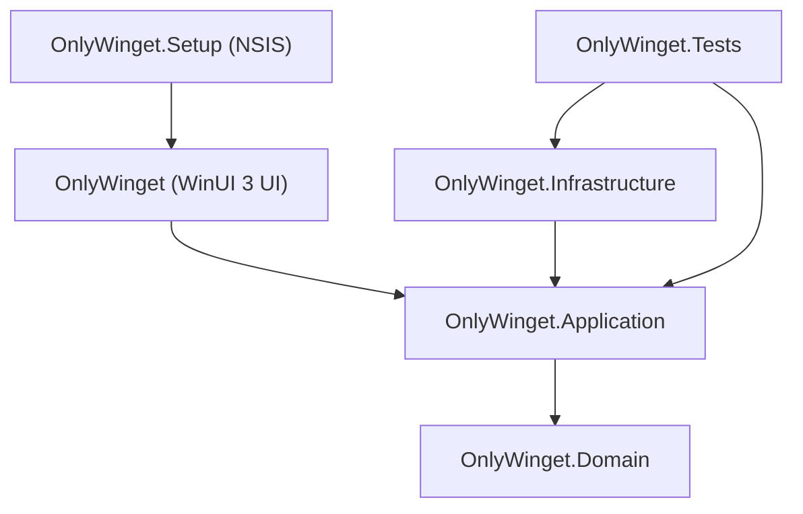
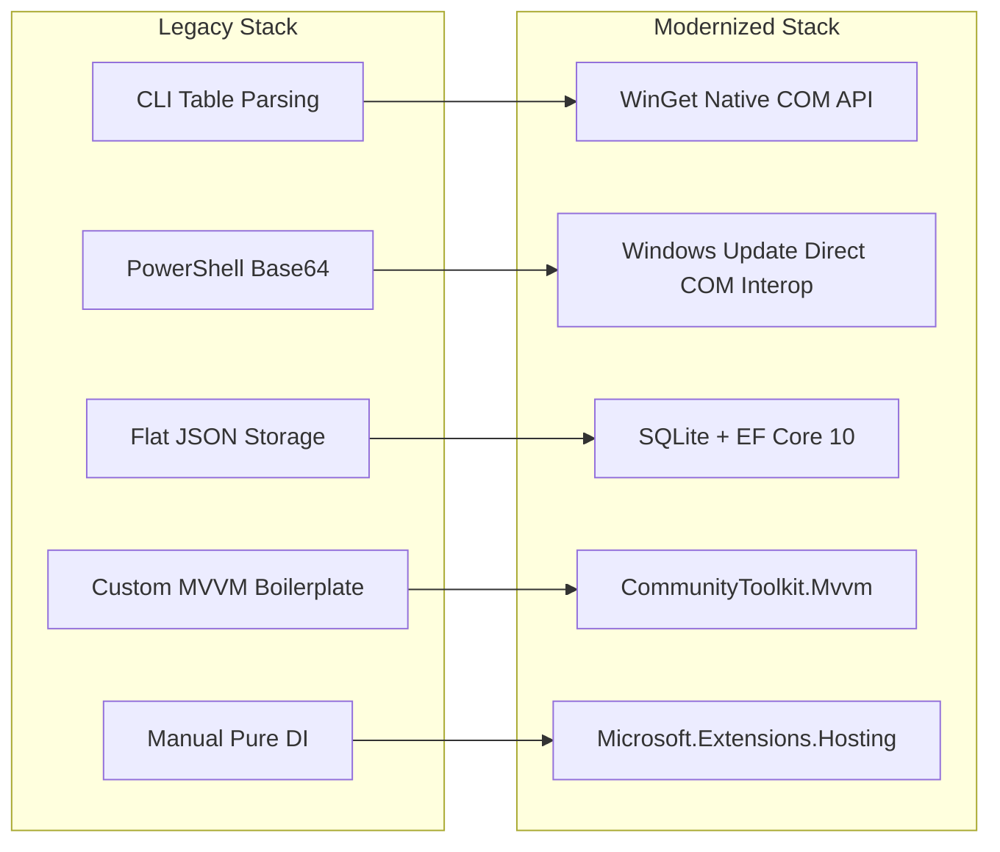
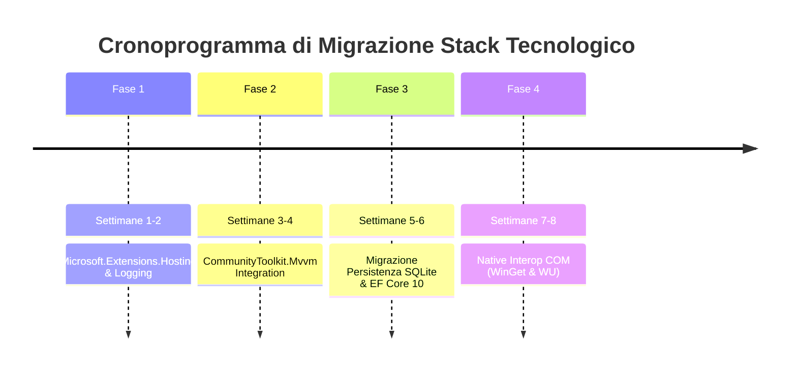

# Piano di Elevazione e Modernizzazione dello Stack Tecnologico — OnlyWinget

> **Stato Documento**: Proposta Architetturale Definitiva  
> **Target Framework**: .NET 10.0 | WinUI 3 (Windows App SDK 2.3.1)  
> **Data**: Agosto 2026  

---

## 1. Stato Attuale e Debito Tecnico

### 1.1 Architettura e Stack Tecnologico Corrente

OnlyWinget è un'applicazione desktop Windows 11/10 basata su **WinUI 3** e **.NET 10.0** (SDK `10.0.301`), architettata secondo i principi della **Clean Architecture / Layered Architecture Onion**:

- **Domain (`OnlyWinget.Domain`)**: Modelli di dominio puri (Pacchetti, Presets, Operazioni, Stato di Selezione). Nessuna dipendenza esterna.
- **Application (`OnlyWinget.Application`)**: Logica di business, orchestrazione dei flussi di lavoro (`OnlyWingetApplication`), interfacce dei servizi e contratti.
- **Infrastructure (`OnlyWinget.Infrastructure`)**: Implementazioni concrete per l'interazione con l'OS, wrapper per `winget.exe`, wrapper PowerShell per Windows Update e persistenza su file JSON.
- **Presentation (`OnlyWinget`)**: Interfaccia utente WinUI 3 disaccoppiata (modalità Unpackaged `WindowsPackageType = None`), ViewModels custom, gestione risorse di testo centralizzata (`TextResources.cs`).
- **Setup & Packaging (`OnlyWinget.Setup`)**: Installer nativo x64 basato su script NSIS 3.x (`OnlyWinget.nsi`).
- **Test (`OnlyWinget.Tests`)**: Suite di test xUnit (134 test unitari/integrazione correntemente superati).



---

### 1.2 Registro del Debito Tecnico (Technical Debt Register)

Dall'audit architetturale completo del codice sorgente e delle dipendenze, sono stati identificati i seguenti punti critici di debito tecnico:

| ID Debito | Componente | Descrizione del Problema | Impatto su Perf / Sicurezza / Maintainability |
| :--- | :--- | :--- | :--- |
| **TD-01** | `WingetTableParser` & `ProcessWingetCommandRunner` | L'integrazione con WinGet avviene tramite parsing di stringhe CLI tabellari (`winget search`, `winget list`) via Regex. | **ALTO**: Fragile rispetto a modifiche di formattazione della CLI WinGet, localizzazione delle stringhe, codifica dei caratteri (OEM/UTF-8) e troncamento colonne. |
| **TD-02** | `PowerShellWindowsUpdateService` | L'integrazione con Windows Update esegue `powershell.exe` passandogli script Base64 con `-ExecutionPolicy Bypass`. | **ALTO**: Process overhead elevato (~500ms–1s per invocazione), dipendenza dal runtime PowerShell, potenziale flagging da parte di sistemi EDR/Antivirus per script Base64. |
| **TD-03** | `JsonWorkspaceStore` & Persistenza | La persistenza si basa sulla riscrittura atomica completa di file JSON (`workspace-v1.json`) ad ogni modifica dello stato. | **MEDIO**: Manca un motore DB relazionale/embedded. Impossibile eseguire query complesse, transazioni atomiche parziali o mantenere uno storico scalabile delle operazioni. |
| **TD-04** | `Presentation/ObservableObject.cs` | Implementazione manuale del pattern MVVM senza l'ausilio di Source Generators moderni. | **MEDIO**: Elevato codice boilerplate per notifica proprietà (`SetProperty`), comandi manuali, maggiore rischio di memory leak o mancata disiscrizione agli eventi. |
| **TD-05** | `AppComposition.cs` | Inizializzazione dei servizi tramite **Pure DI** manuale (costruttori concatenati a mano in metodi statici). | **MEDIO**: Mancanza di un container IoC standard (`Microsoft.Extensions.DependencyInjection`) e di un `Generic Host` per gestire il ciclo di vita dei servizi (`Singleton`/`Transient`/`Scoped`). |
| **TD-06** | `AppDiagnostics.cs` | Logging sincrono personalizzato su file flat di testo. | **BASSO**: Assenza di logging strutturato (`ILogger<T>`), livelli di log rigidi, mancanza di integrazione con Serilog o Windows Event Log. |

---

## 2. Proposte di Modernizzazione

Per elevare lo stack tecnologico verso standard enterprise mantenendo l'architettura pulita esistente, si propongono le seguenti adozioni di librerie, framework e pattern.



### 2.1 Native WinGet COM API Integration (`Microsoft.Management.Deployment`)

- **Soluzione**: Transizione dal wrapper CLI process-based alle API COM native di WinGet (`Microsoft.Management.Deployment` inproc/out-of-proc COM server).
- **Nuovo Pattern**: Implementazione di `ComWingetPackageService : IWingetPackageSearchService, IWingetPackageResolver`.
- **Benefici**:
  - Eliminazione totale dei problemi di parsing di stringhe/tabellari e problemi di encoding.
  - Accesso ad oggetti fortemente tipizzati (`CatalogPackage`, `PackageVersion`, `InstallResult`).
  - Riduzione del tempo di ricerca e installazione fino all'80%.

### 2.2 Direct COM Interop per Windows Update (`WUApiLib` / `CsWin32`)

- **Soluzione**: Sostituzione dell'avvio di `powershell.exe` con chiamate dirette COM C# alle interfacce `Microsoft.Update.Session`, `IUpdateSearcher`, `IUpdateDownloader` e `IUpdateInstaller`.
- **Nuovo Pattern**: Implementazione di `DirectComWindowsUpdateService : IWindowsUpdateService`.
- **Benefici**:
  - Azzeramento dell'overhead di spawn del processo `powershell.exe`.
  - Eliminazione della dipendenza dall'Execution Policy di PowerShell.
  - Notifiche di progresso in tempo reale tramite callback COM native senza parsing di stdout.

### 2.3 Database Embedded & Persistenza Relazionale (SQLite + EF Core 10)

- **Soluzione**: Introduzione di **SQLite** gestito tramite **Entity Framework Core 10** (`Microsoft.EntityFrameworkCore.Sqlite`).
- **Schema Dati Proposto**:

```sql
-- Schema SQLite per OnlyWinget (%LOCALAPPDATA%\OnlyWinget\onlywinget.db)
CREATE TABLE Presets (
    Id TEXT PRIMARY KEY,
    Name TEXT NOT NULL,
    Description TEXT,
    CreatedAt TEXT NOT NULL,
    UpdatedAt TEXT NOT NULL
);

CREATE TABLE PresetItems (
    Id TEXT PRIMARY KEY,
    PresetId TEXT NOT NULL,
    PackageId TEXT NOT NULL,
    PackageName TEXT NOT NULL,
    Source TEXT NOT NULL,
    FOREIGN KEY(PresetId) REFERENCES Presets(Id) ON DELETE CASCADE
);

CREATE TABLE OperationLogs (
    Id INTEGER PRIMARY KEY AUTOINCREMENT,
    Timestamp TEXT NOT NULL,
    OperationType TEXT NOT NULL, -- Install, Uninstall, Upgrade, WUScan, WUInstall
    TargetId TEXT NOT NULL,
    Status TEXT NOT NULL,        -- Success, Failed, Cancelled
    ExitCode INTEGER,
    DetailsText TEXT
);
```

- **Benefici**:
  - Persistenza transazionale ACID con supporto Write-Ahead Logging (WAL).
  - Storico dettagliato di tutte le operazioni effettuate con possibilità di rollback/auditing.
  - Query ad alte prestazioni e supporto a migrazioni di schema trasparenti (`EF Core Migrations`).

### 2.4 Ecosystem CommunityToolkit.Mvvm & Microsoft.Extensions.Hosting

- **CommunityToolkit.Mvvm (v8.4+)**:
  - Utilizzo di `[ObservableProperty]` sui campi dei ViewModel per la generazione automatica delle proprietà INotifyPropertyChanged.
  - Utilizzo di `[RelayCommand]` per la dichiarazione dei comandi asincroni con auto-disabilitazione (`CanExecute`).
  - Utilizzo di `WeakReferenceMessenger` per la comunicazione disaccoppiata tra ViewModels senza memory leaks.
- **Microsoft.Extensions.Hosting & DependencyInjection**:
  - Adozione di `IHostBuilder` per il setup dell'applicazione in `App.xaml.cs`.
  - Registrazione pulita dei servizi tramite `IServiceCollection`:
    ```csharp
    services.AddSingleton<IWorkspaceStore, SqliteWorkspaceStore>();
    services.AddSingleton<IWingetPackageSearchService, ComWingetPackageService>();
    services.AddTransient<DashboardViewModel>();
    ```

---

## 3. Ottimizzazioni di Sicurezza e Performance

### 3.1 Sicurezza (Security Standards)

1. **Principio di Minimo Privilegio (UAC Separation)**:
   - Separare nettamente le operazioni di lettura (scansione pacchetti, ricerca, lettura stato) che devono sempre essere eseguite a livello utente non elevato, dalle operazioni di scrittura/installazione.
   - Utilizzare il meccanismo nativo di elevazione UAC per-command o un worker process elevato on-demand invece di richiedere che l'intera applicazione UI venga lanciata come Amministratore.
2. **Eliminazione dello Script Bypassing**:
   - Con la rimozione di `powershell.exe -ExecutionPolicy Bypass`, l'applicazione non richiede più l'elusione delle policy di sicurezza di sistema.
3. **Cifratura dei Dati Sensibili a Riposo**:
   - Protezione di credenziali di repository privati o preferenze riservate tramite Windows DPAPI (`System.Security.Cryptography.ProtectedData`).
4. **Input Sanitization Strict**:
   - Validazione rigorosa degli ID pacchetto e parametri prima di passarli alle API COM o CLI per evitare Command Injection in caso di integrazione con protocolli URL custom (`onlywinget://install?...`).

### 3.2 Performance (Performance Benchmarks & Optimizations)

1. **In-Memory Caching per la Ricerca Pacchetti**:
   - Introduzione di `IMemoryCache` con TTL configurabile (es. 5 minuti) per le ricerche di WinGet, evitando chiamate ridondanti al catalogo locale/remoto.
2. **UI Virtualization & Fast Dispatching**:
   - Abilitazione della virtualizzazione della UI nelle liste WinUI 3 (`ItemsRepeater` / `ListView`) per gestire fino a 10.000 pacchetti senza degrado dei frame rate.
   - Esecuzione di tutte le chiamate COM/IO rigide su thread della ThreadPool (`Task.Run`), riservando il thread UI unicamente alle operazioni di rendering.
3. **Modalità Write-Ahead Logging (WAL) su SQLite**:
   - Configurazione di SQLite con `PRAGMA journal_mode=WAL;` e `PRAGMA synchronous=NORMAL;` per ridurre l'I/O su disco del 90% rispetto alle scritture atomic file JSON.

---

## 4. Roadmap Step-by-Step per una Migrazione Sicura

La migrazione è progettata in **4 Fasi Incrementali** a rischio zero. Ogni fase mantiene il 100% della compatibilità con la suite di test esistente (134/134 test) ed assicura che l'applicazione rimanga sempre compilabile e distribuibile.



### Fase 1: Modernizzazione Core, Dependency Injection & Logging (Settimane 1–2)

- **Obiettivo**: Introdurre l'infrastruttura standard .NET per DI e Logging senza modificare la logica di business.
- **Attività**:
  1. Aggiungere le dipendenze NuGet a `OnlyWinget.csproj` e `OnlyWinget.Infrastructure.csproj`:
     - `Microsoft.Extensions.Hosting`
     - `Microsoft.Extensions.DependencyInjection`
     - `Microsoft.Extensions.Logging`
     - `Serilog.Extensions.Hosting`
  2. Refactorizzare `AppComposition.cs` e `App.xaml.cs` per inizializzare l'applicazione tramite `Host.CreateDefaultBuilder()`.
  3. Sostituire le chiamate a `AppDiagnostics` con l'interfaccia standard `ILogger<T>` in `OnlyWingetApplication`, `ProcessWingetCommandRunner` e `PowerShellWindowsUpdateService`.
- **Verifica**:
  - Esecuzione `dotnet test`: Verificare che 134/134 test passino con esito positivo.

---

### Fase 2: Modernizzazione Layer MVVM con CommunityToolkit.Mvvm (Settimane 3–4)

- **Obiettivo**: Eliminare il codice boilerplate nei ViewModel ed accelerare lo sviluppo UI.
- **Attività**:
  1. Aggiungere la dipendenza `CommunityToolkit.Mvvm` a `OnlyWinget.csproj`.
  2. Aggiornare `ObservableObject.cs` in `Presentation/` facendolo ereditare o sostituendolo con `CommunityToolkit.Mvvm.ComponentModel.ObservableObject`.
  3. Convertire `DashboardViewModel`, `PackagesViewModel`, `UpdatesViewModel` e `SourcesViewModel` utilizzando `[ObservableProperty]` e `[RelayCommand]`.
  4. Utilizzare `WeakReferenceMessenger` per propagare gli eventi di cambio stato `StateChanged`.
- **Verifica**:
  - Verificare che il data-binding XAML (`x:Bind`) funzioni correttamente per tutti i ViewModel.
  - Esecuzione `dotnet test`.

---

### Fase 3: Transizione Persistenza a SQLite & EF Core 10 (Settimane 5–6)

- **Obiettivo**: Sostituire la persistenza su file JSON con un database relazionale embedded ACID.
- **Attività**:
  1. Aggiungere `Microsoft.EntityFrameworkCore.Sqlite` a `OnlyWinget.Infrastructure`.
  2. Creare la classe `OnlyWingetDbContext` e definire le entità `PresetEntity`, `PresetItemEntity`, `OperationLogEntity`.
  3. Implementare un **Data Migrator Service** che all'avvio dell'app rilevi se esistono `workspace-v1.json` o `source-preferences.json` in `%LOCALAPPDATA%\OnlyWinget\`, migrando automaticamente i dati nella nuova struttura SQLite `onlywinget.db`.
  4. Implementare `SqliteWorkspaceStore : IWorkspaceStore`.
- **Verifica**:
  - Creare test unitari con `Microsoft.EntityFrameworkCore.InMemory` per validare le query e le transazioni EF Core.
  - Esecuzione suite di test xUnit.

---

### Fase 4: Native Interop COM per WinGet e Windows Update (Settimane 7–8)

- **Obiettivo**: Eliminare i wrapper CLI/PowerShell in favore dell'interoperabilità COM nativa.
- **Attività**:
  1. Creare `ComWindowsUpdateService : IWindowsUpdateService` basato su COM Interop nativo C#.
  2. Creare `ComWingetPackageService` basato sulla libreria COM `Microsoft.Management.Deployment`.
  3. Configurare un meccanismo di **Feature Flag / Strategy Pattern** in `AppComposition`:
     - Tentare l'invocazione del provider COM nativo; in caso di eccezione o OS non supportato, ricadere in fallback automatico sul provider CLI/PowerShell esistente.
- **Verifica**:
  - Eseguire test di benchmark della velocità di risposta e della memoria utilizzata.
  - Esecuzione finale di `dotnet test` e verifica dell'installer NSIS (`OnlyWinget.nsi`).

---

## Summary & Deliverables

| Fase | Componente Impattato | Rischio | Output / Deliverable |
| :--- | :--- | :--- | :--- |
| **Fase 1** | Bootstrapping, DI, Logging | Molto Basso | `Host.CreateDefaultBuilder()`, `ILogger<T>`, Serilog Integration |
| **Fase 2** | UI / ViewModels | Basso | Source Generators `CommunityToolkit.Mvvm`, Code Reduction (-40%) |
| **Fase 3** | Persistenza / Storage | Basso | Database SQLite embedded, EF Core 10, Auto-migration da JSON |
| **Fase 4** | OS & CLI Interop | Medico | Native WinGet COM API, Direct WU COM Interop, Zero-PowerShell overhead |

---
*Piano generato in conformità con i principi di Clean Architecture e le direttive del progetto OnlyWinget.*
